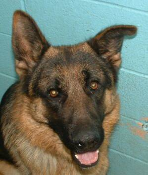
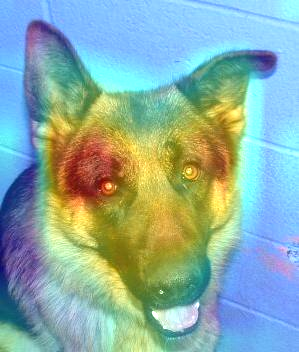
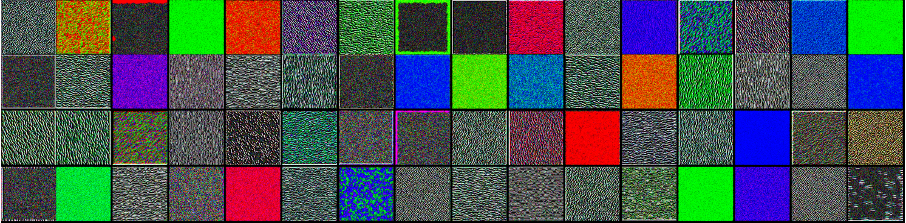
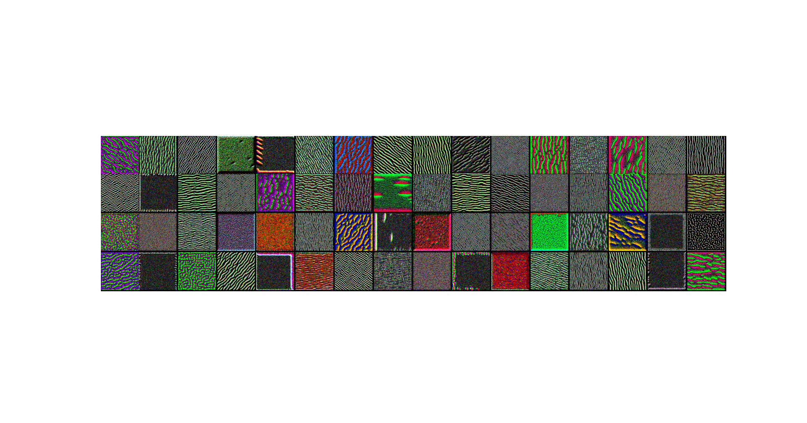
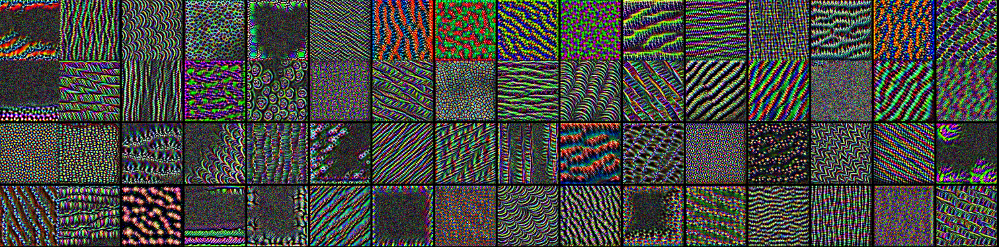
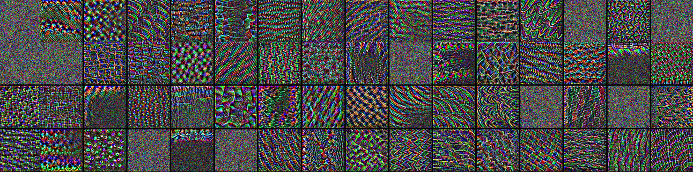
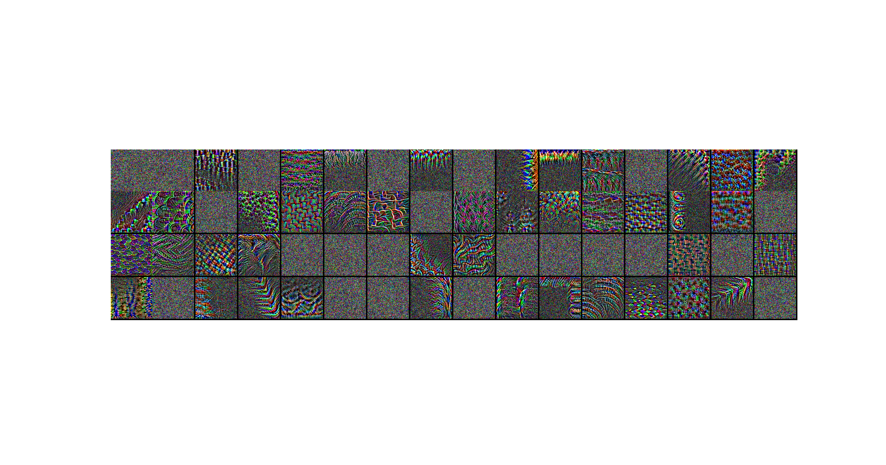
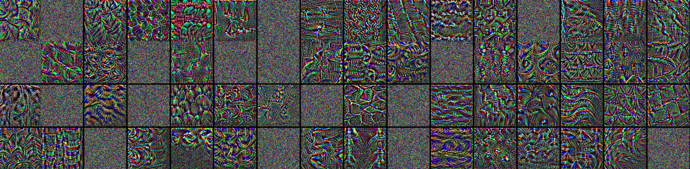

Training own: `Cats_Dogs_classification.py` and using pretrained VGG: `Using_Pretrained_Net.py` convolutional NNs to differentiate cats and dogs.

Also visualizing neural networks learning process `visualizing_convnets.py` using different techniques

___
## Visualizing Heatmap
#### Being 86% sure about German Shepherd, that is the real image on the left, as well as the same image with a heatmap of what region impacts network's decision the most:

 
   
   

___
## Visualizing What Excites Networks The Most

#### Each image represents pixels that activate this specific filter the most (64 squares in image correspond to 64 plotted filters). Top images tell about the first layers, going deeper to the network in the bottom ones.

 
   
   
   
   
   
   

___
