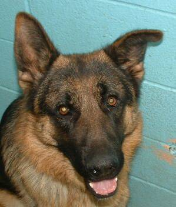
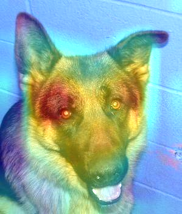

Training own: `Cats_Dogs_classification.py` and using pretrained VGG: `Using_Pretrained_Net.py` convolutional NNs to differentiate cats and dogs.

Also visualizing neural networks learning process `visualizing_convnets.py` using different techniques 
or
 
